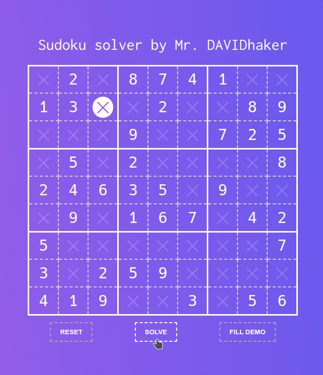

# Sudoku solver
Fun project for solving...

Clone repo, open index.html in browser, then press `FILL DEMO` or write by hands and press `SOLVE`.
**Also** working arrow keys, numpad, enter, space and backspace. Enjoy!

# Support
I want to add more features later...

You can support me via

Ethereum: 0x2BD7aA911861029feB08430EEB9a36DC9a8A14d2 (also accept any token :-) )

BUSD/BNB or any token (BEP20): 0x74e47ae3A26b8C5cD84d181595cC62723A1B114E

Any thinks: me@davidhaker.ru